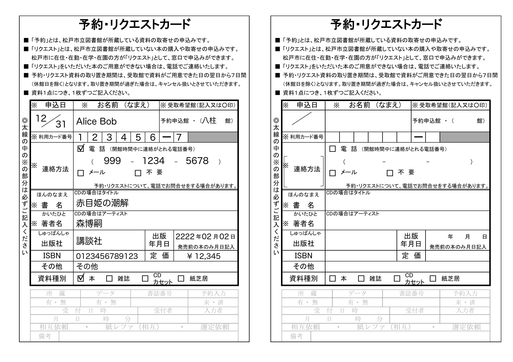

# matsudo-city-library-request-card-generator

千葉県の松戸市立図書館のリクエストカードを手書きせずにすむようにするプログラムです。

必要な情報を与えると、[図書館のウェブサイトにあるリクエストカードのテンプレート](https://www.city.matsudo.chiba.jp/library/riyouannai/toshokannoriyou.html#cms47FB3)にテキストを埋めた画像を生成します。

## Licence

[GNU GPLv3](./LICENSE)
